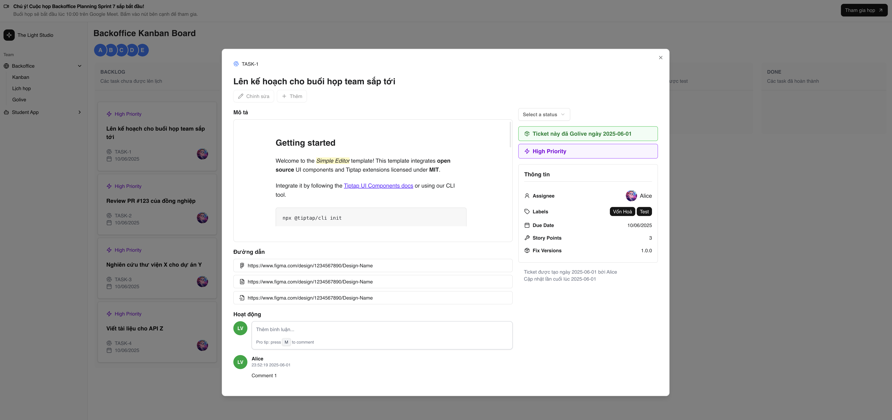

# <center> Surf - Công cụ quản lý công việc dành cho nhóm phát triển nhỏ và vừa </center>

<center>


Surf là nền tảng quản lý công việc phát triển sản phẩm phần mềm toàn diện dành cho các đội nhóm nhỏ và vừa. Thấu hiểu mong muốn xây dựng nhanh để nhanh chóng mang sản phẩm đến với người dùng, Surf linh hoạt đáp ứng nhu cầu và hỗ trợ đội nhóm nắm bắt tiến độ của dự án một cách đơn giản, tiện lợi.

</center>

## Tính năng chính

### Quản lý công việc với Kanban

- Tạo các ticket công việc chờ ở Backlog. Các ticket chia ra các cột theo trạng thái phát triển, giúp đội ngũ nắm bắt tiến độ
- Xem chi tiết tiến độ và bàn giao công việc
- Subtask cho từng ticket
- Đính kèm các tài liệu quan trọng như thiết kế, tài liệu đặc tả trực tiếp vào ticket

### Quản lý lịch họp

- Tạo lịch họp linh hoạt với các thành viên trong nhóm
- Email nhắc nhở lịch họp

### Quản lý phát hành phiên bản

- Khởi tạo và quản lý các ticket theo phiên bản release
- Người quản lý cần duyệt các ticket trước khi release
- Nắm bắt tiến độ chuẩn bị cho release
- Quản lý nội dung các release trước đó

## Cài đặt

### 1. Clone repository về

```
git clone https://github.com/P-ro-VL/Surf.git
```

### 2. Khởi chạy Backend (xem repository dành cho Backend tại [đây](https://))

### 3. Khởi chạy Front End

```
npm run dev
```
